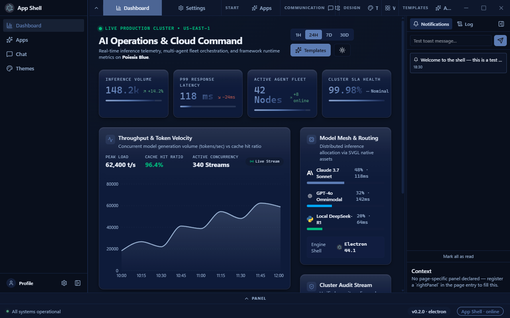
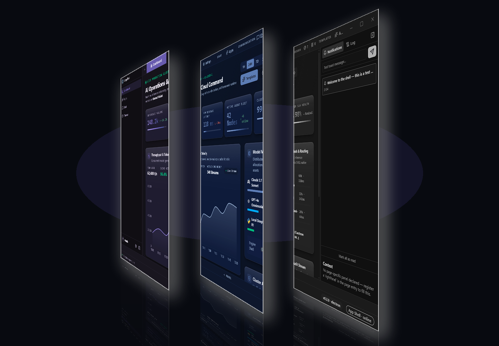
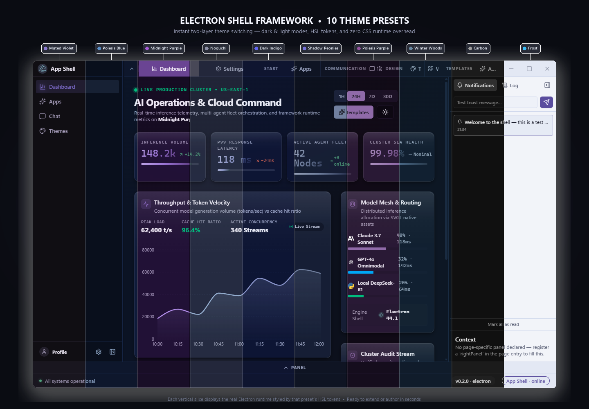

# Repo Cockpit

A reusable Electron desktop app-shell framework and developer cockpit. Dark/light theming, a single merged top bar (tabs + window controls), collapsible sidebars, dynamic compact tabs, page registry, native SVGL brand kit, encrypted config storage, framework UI blocks, auto-update, and 11 production app templates.




Pure Windows desktop — no server, no web attach, no mock data. Every number on
screen comes from `git`, `gh` or a live child process.


## What it does

| Page          | Real source                                                                                                                                                       |
| ------------- | ----------------------------------------------------------------------------------------------------------------------------------------------------------------- |
| **Repos**     | `git status --porcelain=v1 -z --branch`, `git remote get-url`, `git log -1`, `git stash list`, `git worktree list --porcelain`, + npm scripts from `package.json` |
| **Worktrees** | `git worktree list --porcelain`; creates via `git worktree add -b <branch>`; prunes via `git worktree prune -v`                                                   |
| **Builds**    | `npm run <script>` as a supervised child process — real pid, streamed stdout/stderr, real exit code, cancellable                                                  |
| **PR Queue**  | `gh pr list --json …` per repo (uses your existing `gh` login)                                                                                                    |
| **CI Runs**   | `gh run list --json …` per repo, with real durations from `createdAt`/`updatedAt`                                                                                 |

Three shell regions are wired to live app state rather than placeholders:

- **Bottom panel — a real terminal.** `node-pty` spawns a genuine ConPTY
  pseudo-console per repository (pwsh, else `powershell.exe`); `xterm.js`
  renders it and forwards keystrokes. Colours are rebuilt from the active theme
  tokens, so the terminal follows the app's preset. Switching repos disposes
  and re-attaches, so keystrokes can never land in the wrong shell.
- **Right rail — the activity log.** Main-process events stream in live: scans,
  `gh` queries, every line a build prints, PTY attach/close, worktree commands.
  `Notify` filters that same stream to warnings/errors/successes with an unread
  count.
- **Footer — a real daemon heartbeat.** A 2s tick from the main process carries
  pid, uptime, repo count, live shell count and running builds. If the ticks
  stop, the dot drains and the text says so.

## Architecture

```
src/main/cockpit/
  exec.ts         execFile wrapper — argv arrays only, never a shell string
  git.ts          the only place that shells out to git
  github.ts       gh CLI: auth check, pr list, run list
  builds.ts       BuildSupervisor — spawn, stream, cancel, kill on quit
  pty.ts          PtySupervisor — ConPTY sessions, 40ms flush backpressure
  store.ts        main-process source of truth + event fan-out
  validate.ts     zod schemas for every renderer-supplied value
  ipc-cockpit.ts  the IPC surface (sender-gated, validated)
src/main/cockpit-parsers.ts   pure parsers — unit-testable, no I/O
src/shared/cockpit-types.ts   the typed contract shared by both sides
```

**Security posture.** `sandbox`, `contextIsolation` and the framework's fuses
are untouched. Every channel passes a sender gate (owned window + top frame +
our own document). Every renderer value is zod-validated, and anything reaching
a child process is additionally checked against live state — a build script must
exist in that repo's `package.json`, and `openPath` only accepts a path from a
repo we actually inspected. `execFile` with argv arrays means a repo path or
branch name containing shell metacharacters cannot break out.

## Run it

```bash
npm install
npm run typecheck && npm run lint && npm test
npm run build
./node_modules/.bin/electron .        # pure desktop, no server
npm run dist:win                      # NSIS installer + portable exe
```

### Windows: unblock the install scripts first

npm's `allowScripts` gate blocks the postinstall that downloads Electron's
binary, plus `esbuild`'s and `node-pty`'s native builds. Without this the app
cannot launch at all:

```bash
npm install-scripts approve esbuild electron-winstaller node-pty
npm rebuild esbuild node-pty
./node_modules/.bin/electron --version     # must print v44.x
```

`node-pty` ships Windows prebuilds (`prebuilds/win32-x64/pty.node`, `conpty.dll`,
`OpenConsole.exe`), so no C++ toolchain is required for it.

## Verification

The scripts in `scripts/` drive the running app over CDP, so the UI is checked
against a real window rather than a stub:

```bash
./node_modules/.bin/electron . --remote-debugging-port=9334 --remote-allow-origins=*
python scripts/cdp-read-ui.py          # asserts sidebar/tabs/KPIs/PTY painted
python scripts/cdp-test-build.py       # starts a real build, asserts running → passed
python scripts/cdp-shot-default.py     # captures the app's boot state
```

> `cdp-shot-default.py` is the screenshot tool, not `cdp-shot.py`: the latter
> exists to apply a preset, and applying one reloads the page — a reload
> collapses the bottom panel (a devtools-only state, never reachable by a user),
> so it produces a misleading image.

`cdp-test-build.py` output is the proof the build supervisor is real:

```
STARTED: {"id":"build_...","status":"running","pid":26412,"script":"typecheck"}
  [5] status=passed exit=0 lines=2
FINAL:   {"status":"passed","exitCode":0,"lineCount":2,"pid":26412}
CAPTURED OUTPUT: 2 lines
```

## Shell Layout Architecture



The framework ships **three native layout engines** (`src/renderer/src/types/shell.ts`), allowing you to build dashboards, writing studios, or compact utilities without forking the shell:

| Mode                      | Best For                               | Navigation                              | Top Bar                                  | Right Dock             |
| :------------------------ | :------------------------------------- | :-------------------------------------- | :--------------------------------------- | :--------------------- |
| **`dashboard`** (Default) | Operations, analytics, multi-page apps | Collapsible sidebar + dynamic tabs      | Merged top bar (tabs + controls)         | Per-page inspector     |
| **`studio`**              | Writing, documents, IDEs, canvas tools | Hierarchical tree (workspace $\to$ doc) | Document action bar (breadcrumb + tools) | Contextual review dock |
| **`compact`**             | Single-purpose utilities, focus tools  | Folded segmented top bar                | Unified slim bar with menu               | Optional utility dock  |

### Core Shell Invariants

- **Single Top Bar** — Tab strip and native window controls share one unified 40px bar. The `⇅` toggle collapses tabs into a slim active-title strip.
- **Dynamic Responsive Tabs** — On narrow viewports or container resize, tabs automatically collapse to centered icon-only mode with floating tooltips.
- **Collapsible Sidebar** — Smoothly switches between 250px expanded and 64px icon rail with centered vertical tool stack and zero border collision.
- **Native SVGL Brand Kit** — Built-in integration with [svgl.app](https://svgl.app) for tech & brand logos (`icon: 'electron'`) with offline caching and light/dark theme switching.
- **Right Inspector Panel** — Contextual activity and inspector drawer with per-page customization.
- **Bottom Panel** — Collapsible terminal or logs drawer.
- **Full-Width Status Footer** — Persistent status frame with health indicators, engine telemetry, and versioning.

_Read [docs/SHELL-MODES.md](docs/SHELL-MODES.md) for full layout slot documentation._

## Create a new app in 5 steps

1. **Clone** this repo (or copy the folder) → `my-app/`.
2. **Pages**: create `src/renderer/src/pages/MyPage.tsx`.
3. **Register**: add an entry to the array in `src/renderer/src/pages/registry.tsx`:

```tsx
{
  id: 'my-tool',
  label: 'My Tool',
  icon: WrenchIcon,
  component: MyPage,
  rightPanel: MyPageInspector // optional per-page side panel
}
```

4. **Rename**: update `name` in `package.json` (or set it in Settings → Branding at runtime).
5. `npm run dev` — your page now gets a sidebar icon, a tab, and (if provided) a right panel. No shell edits.

## Framework blocks

`src/renderer/src/blocks/` ships two copy-paste demo blocks (wired to the theme tokens so they follow dark/light):

- **`ExampleChart.tsx`** — recharts area chart (replace the demo data with your metrics).
- **`ExampleForm.tsx`** — zod + react-hook-form typed form with inline validation.

## IPC contract

Renderer talks to main through `window.api` only (contextIsolation on, sandbox on).

| API                                           | Channel              | Purpose                           |
| --------------------------------------------- | -------------------- | --------------------------------- |
| `window.api.config.get/set/has(key)`          | `config:*`           | Encrypted config store            |
| `window.api.app.version()/ping()`             | `app:*`              | Version + platform health check   |
| `window.api.window.minimize/maximize/close()` | `window:*`           | Frameless window controls         |
| `window.api.window.setOpacity(v)`             | `window:setOpacity`  | Native window opacity (persisted) |
| `window.api.update.check()/quitAndInstall()`  | `update:*`           | Auto-update (GitHub releases)     |
| `window.api.update.onStatus(fn)`              | push `update:status` | Live update events → Settings UI  |

Extend in `src/main/ipc.ts` + `src/preload/index.ts` — both are the only contract files a future backend touches.

## Packaging & updates

- `npm run dist:win` → `release/<version>/` with a **NSIS installer** (`App Shell-Setup-<version>.exe`, custom install dir, desktop + start-menu shortcuts) and a **portable exe**.
- Auto-update is wired through `electron-updater` and the GitHub `publish` provider in `electron-builder.yml`. Tag a release as `vX.Y.Z` and push — packaged installs pick it up via Settings → Updates → Check for updates.
- `scripts/generate-icon.js` creates the app icon (PNG + ICO) — run `npm run icon` after restyling.

## Theming



All colors are CSS variables in `src/renderer/src/styles/theme.css`
(`--background`, `--foreground`, `--primary`, `--sidebar-*`, `--chart-*`, …) with a `[data-theme='dark']` block, mapped into Tailwind v4 via `@theme inline` so utilities like `bg-card`, `border-input`, `text-muted-foreground` work. To brand an app: restyle the variables — every component picks them up automatically.

## The shell was not forked

Pages live in `src/renderer/src/pages/registry.tsx`; the two dock regions are
filled through `AppShell` slots. The only framework edits are two optional slot
props (`bottomDock`, `rightDock`) that default to the previous behaviour when an
app does not pass them — proposed upstream on the `feat/app-shell-dock-slots`
branch of electron-shell-framework.
