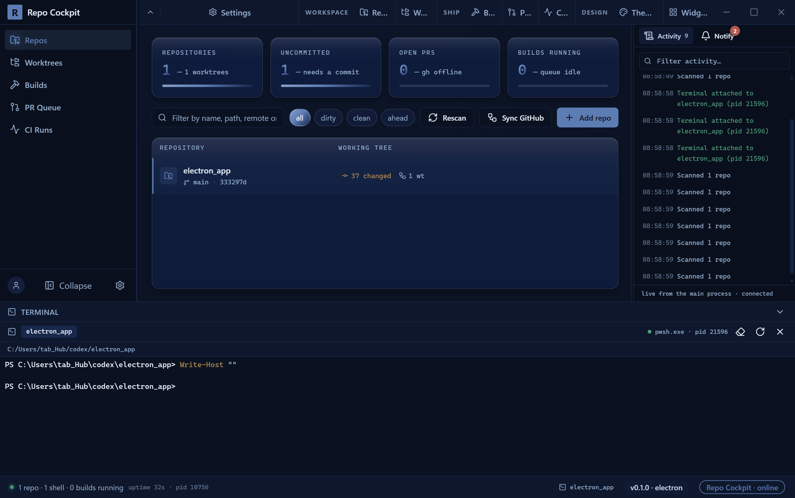

# Repo Cockpit

A multi-repo developer workspace built on
[electron-shell-framework](https://github.com/hlsitechio/electron-shell-framework).

Pure Windows desktop — no server, no web attach, no mock data. Every number on
screen comes from `git`, `gh` or a live child process.



## What it does

| Page          | Real source                                                                                                                                                       |
| ------------- | ----------------------------------------------------------------------------------------------------------------------------------------------------------------- |
| **Repos**     | `git status --porcelain=v1 -z --branch`, `git remote get-url`, `git log -1`, `git stash list`, `git worktree list --porcelain`, + npm scripts from `package.json` |
| **Worktrees** | `git worktree list --porcelain`; creates via `git worktree add -b <branch>`; prunes via `git worktree prune -v`                                                   |
| **Builds**    | `npm run <script>` as a supervised child process — real pid, streamed stdout/stderr, real exit code, cancellable                                                  |
| **PR Queue**  | `gh pr list --json …` per repo (uses your existing `gh` login)                                                                                                    |
| **CI Runs**   | `gh run list --json …` per repo, with real durations from `createdAt`/`updatedAt`                                                                                 |

Three shell regions are wired to live app state rather than placeholders:

- **Bottom panel — a real terminal.** `node-pty` spawns a genuine ConPTY
  pseudo-console per repository (pwsh, else `powershell.exe`); `xterm.js`
  renders it and forwards keystrokes. Colours are rebuilt from the active theme
  tokens, so the terminal follows the app's preset. Switching repos disposes
  and re-attaches, so keystrokes can never land in the wrong shell.
- **Right rail — the activity log.** Main-process events stream in live: scans,
  `gh` queries, every line a build prints, PTY attach/close, worktree commands.
  `Notify` filters that same stream to warnings/errors/successes with an unread
  count.
- **Footer — a real daemon heartbeat.** A 2s tick from the main process carries
  pid, uptime, repo count, live shell count and running builds. If the ticks
  stop, the dot drains and the text says so.

## Architecture

```
src/main/cockpit/
  exec.ts         execFile wrapper — argv arrays only, never a shell string
  git.ts          the only place that shells out to git
  github.ts       gh CLI: auth check, pr list, run list
  builds.ts       BuildSupervisor — spawn, stream, cancel, kill on quit
  pty.ts          PtySupervisor — ConPTY sessions, 40ms flush backpressure
  store.ts        main-process source of truth + event fan-out
  validate.ts     zod schemas for every renderer-supplied value
  ipc-cockpit.ts  the IPC surface (sender-gated, validated)
src/main/cockpit-parsers.ts   pure parsers — unit-testable, no I/O
src/shared/cockpit-types.ts   the typed contract shared by both sides
```

**Security posture.** `sandbox`, `contextIsolation` and the framework's fuses
are untouched. Every channel passes a sender gate (owned window + top frame +
our own document). Every renderer value is zod-validated, and anything reaching
a child process is additionally checked against live state — a build script must
exist in that repo's `package.json`, and `openPath` only accepts a path from a
repo we actually inspected. `execFile` with argv arrays means a repo path or
branch name containing shell metacharacters cannot break out.

## Run it

```bash
npm install
npm run typecheck && npm run lint && npm test
npm run build
./node_modules/.bin/electron .        # pure desktop, no server
npm run dist:win                      # NSIS installer + portable exe
```

### Windows: unblock the install scripts first

npm's `allowScripts` gate blocks the postinstall that downloads Electron's
binary, plus `esbuild`'s and `node-pty`'s native builds. Without this the app
cannot launch at all:

```bash
npm install-scripts approve esbuild electron-winstaller node-pty
npm rebuild esbuild node-pty
./node_modules/.bin/electron --version     # must print v44.x
```

`node-pty` ships Windows prebuilds (`prebuilds/win32-x64/pty.node`, `conpty.dll`,
`OpenConsole.exe`), so no C++ toolchain is required for it.

## Verification

The scripts in `scripts/` drive the running app over CDP, so the UI is checked
against a real window rather than a stub:

```bash
./node_modules/.bin/electron . --remote-debugging-port=9334 --remote-allow-origins=*
python scripts/cdp-read-ui.py     # asserts the sidebar/tabs/KPIs/PTY painted
python scripts/cdp-test-build.py  # starts a real build, asserts running → passed
python scripts/cdp-shot.py        # sets the preset, captures docs/cockpit-ui.png
```

`cdp-test-build.py` output is the proof the build supervisor is real:

```
STARTED: {"id":"build_...","status":"running","pid":26412,"script":"typecheck"}
  [5] status=passed exit=0 lines=2
FINAL:   {"status":"passed","exitCode":0,"lineCount":2,"pid":26412}
CAPTURED OUTPUT: 2 lines
```

## The shell was not forked

Pages live in `src/renderer/src/pages/registry.tsx`; the two dock regions are
filled through `AppShell` slots. The only framework edits are two optional slot
props (`bottomDock`, `rightDock`) that default to the previous behaviour when an
app does not pass them — proposed upstream on the `feat/app-shell-dock-slots`
branch of electron-shell-framework.
